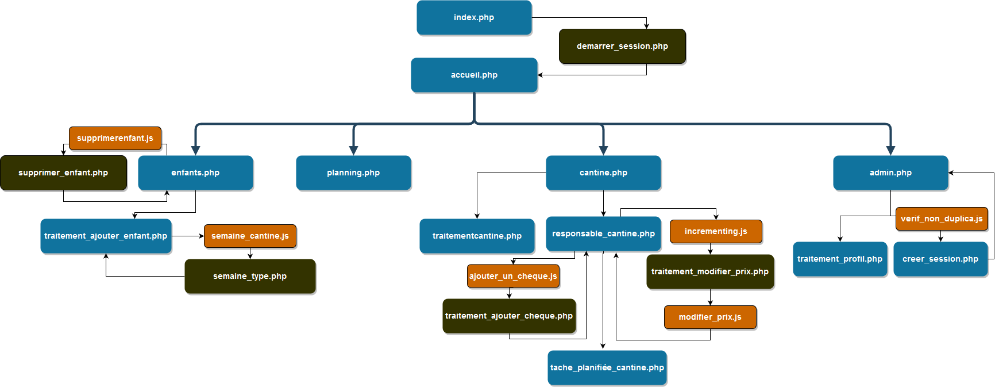
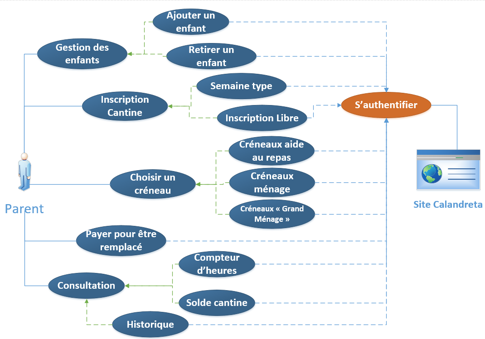
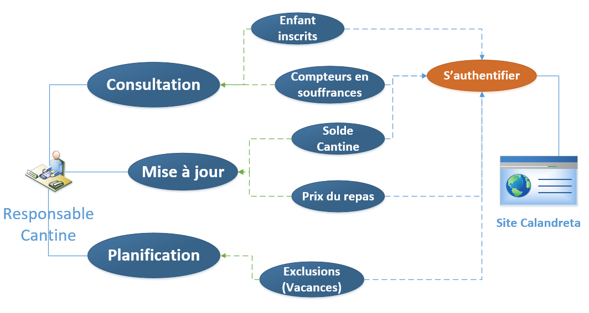
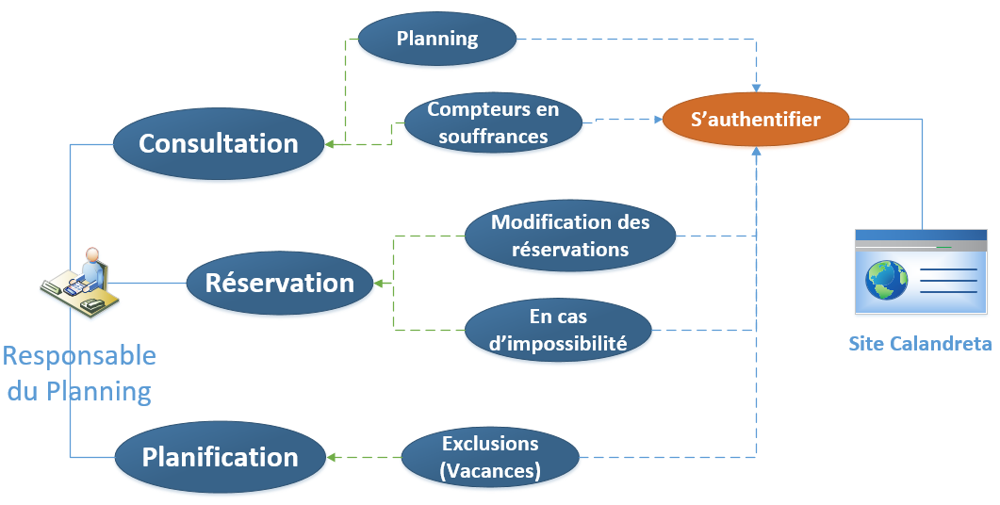
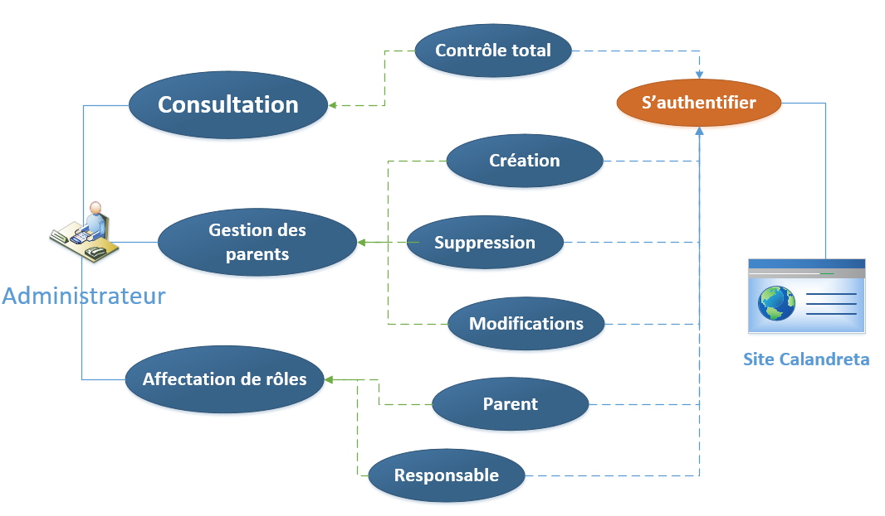
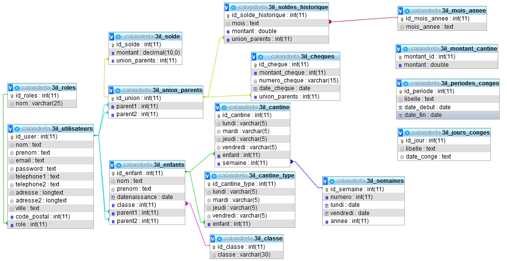

# Calandreta
Gestion d'une cantine d'une école Ruthenoise

__Besoin du site internet :__
1. Compte individuel pour chaque parents
2. Enregistrer ses enfants et modifier ses informations (classes, semaine de cantine type)
3. Espace Admin pour donner des autorisations spécifiques à quelques parents (dépôt de chèques, consulter nombres de repas à commander)
4. Enregistrer une semaine de cantine pour son enfant
5. Gestion du solde des comptes des parents
# Architecture du site

# Diagramme des cas d'utilisation
## Rôle parents

## Rôle responsable cantine

## Rôle responsable planning

## Rôle admin

# Base de données

